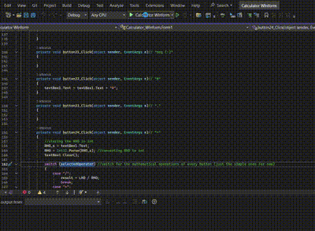

# Lern-Periode-6
Lern-Periode-1, aber im repetierten Jahr, also LP6. Hier werde ich ein paar Projekte von letztem Jahr fertigmachen und versuchen, meine GitHub Repositories auf das nächste Level zu bringen

# Grob-Planung

- Projekte von letztem Jahr fertigmachen
- KI-Projekt
- GitHub Seiten schön machen

  
## Fein-Planung

- Timer
- KI
- Jetspecs

## Arbeit 23.08.2024

Heute möchte ich noch "for old times sake" einen Timer programmieren, weil ich das noch nie gemacht habe, und ich möchte mein KI-Projekt mit Abbas Raza wieder aufstarten.
Ich möchte meine Winforms auch noch erfrischen und besser machen für das bald aufkommende C# Projekt.

- [x] Timer C#
- [ ] Winforms Calculator

## Fein-Planung 30.08.2024

Letztes Mal war ich fast exklusiv damit beschäftigt, meinen Mitschülern zu helfen, weil ich repetent bin und mehr Erfahrung habe. Das ist ironisch, weil ich erst am zweiten Schultag angefangen habe, echt zu programmieren. Heute möchte ich also meine Projekte von gestern fertigmachen.

- [x] Timer C#
- [x] Winforms Calculator UI
- [ ] Winforms Calculator functions

### Zusammenfassung 30.08.2024:
Heute habe ich wieder viel meinen Mitschülern geholfen und bin deswegen nicht dazu gekommen, meine eigenen Arbeitspakete zu erledigen. Ich habe jedoch den Calculator angefangen und habe Buttons 1 bis 17 schon im UI gemacht. Es ist eine fast identische Kopie des Windows Taschenrechners im "Standard" Modus, es fehlen aber die Konstanten, die man dort klicken könnte. Ich werde zu Hause meinen Taschenrechner fertigmachen und dann den Timer programmieren, damit ich das endlich abkreuzen kann.

## Arbeitspakete auf Sondertag 07.09.2024

- [x] Buttons 18-24 Namen und Code geben
- [ ] Hauptfunktionen im top bar programmieren
- [ ] Basisfunktionen im Sidebar
- [ ] Ignorieren von Inputs, die keine Zahl sind

Heute habe ich eine Sondersitzung für mich eingelegt, weil ich bisher im Unterricht meinen lieben Klassenkameraden unter die Arme gegriffen habe. Dabei habe ich die Zahlenbuttons erstellt.

## Arbeitspakete 13.09.2024

Hier habe ich vergessen zu committen 😒😒😒

## Arbeitspakete auf 20.09.2024

- [x] Wenn Eingabe und klick auf `/`, dann Konvertierung erste Zahl in `LHO`
- [x] Gleich-Funktion: Konvertierung vom zweiten Operator
- [x] Gleich-Funktion, Teil 2: Division wird ausgeführt und dargestellt.
- [ ] Gleiches für die anderen Operatoren (+, -, *) zum Beispiel mit `switch`

Heute habe ich endlich fortschritt bei meinem Calculator. Das Programm ist aktuell sehr simpel, es hat noch kein Exception Handling und es kann nur mit int rechnen statt mit double. Ich habe gelernt, wie mit Variablen umzugehen, die von einer Textbox kommen, und die Regeln dazu. Nach einer langen frustrierenden Zeit, wo der Taschenrechner nur 1 oder 0 oder das LHO ausgegeben hat, habe ich es doch hinbringen können, dass es funktioniert. Ich habe auch ein paar kleine Dinge gelernt über "oder of operation", und werde jetzt besser darauf achten, dass ich nicht ZB ein Resultat ausgebe, bevor es überhaupt berechnet wurde.

# Reflexion LP-1

Im Allgemeinen war diese LP ein sehr guter Start ins Jahr. Ich habe meinen Klassenkameraden viel geholfen, und ich konnte gut fokussieren und habe sehr viel gelernt von den Problemen, die die anderen hatten. In Rücksicht finde ich es nicht sehr schlimm, dass ich den anderen geholfen habe und deswegen ein bisschen auf meine eigenen Ziele verzichtet habe, weil es eben doch eine gute Lernerfahrung war. Das wichtigste, was ich gelernt habe, war aber nicht davon, sondern es liegt in meiner Organisation und Planung. Ich habe immer "the big picture" gesehen und habe zu viel aufs mal versucht, was dazu führte, dass ich mehrmals festlief. Wie ZB bei dem Taschenrechner:
Ich wollte, dass man mehrere Inputs mit mehreren Operatoren gleichzeitig berechnen konnte, und dazu, dass die Textbox multiline war. Der Lehrer hat mich dann darauf angedeutet, dass es besser ist, grosse Projekte Schritt vor Schritt zu machen und so viel möglich aufzuteilen. Plötzlich wurde so eine riesige Aufgabe zu "Wenn Eingabe und klick auf `/`, dann Konvertierung erste Zahl in `LHO`" und es war machbar. Ich habe das dann mehrmals gemacht und habe schlussendlich eine funktionierende Dividierungs-Funktion. Auf der nächsten LP werde ich meine Arbeitspakete möglichst konkret (wie oben) schreiben und wenn ich festlaufe, werde ich mal aus zoomen und schauen, wo ich kleine Teile zuerst erledigen kann.

